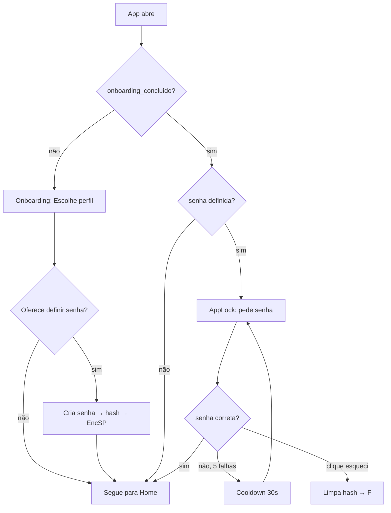

# ADR 0006 — Perfil local opcional (sem auth online, com AppLock opcional)

- **Status:** Aceito
- **Data:** 2026-09-17
- **Complementa:** [ADR-0005](0005-sem-autenticacao-online.md)
- **Issue:** #7 (reciclada)

## Contexto

A ADR-0005 (2026-09-17) decidiu que o BrainOutApp é **100% offline** e que não há autenticação online. Mas o **PRD original exige 2 perfis com permissões diferentes** (Gerente / Colaborador, requisito R2):

| Perfil | Pode criar projetos | Pode atribuir tarefas | Vê dashboard consolidado | Vê só o que é dele |
|--------|---------------------|------------------------|---------------------------|---------------------|
| **Gerente** | ✅ | ✅ | ✅ | ❌ (vê tudo) |
| **Colaborador** | ❌ | ❌ | ❌ | ✅ |

O requisito R8 (notificações) também pressupõe identidade do destinatário ("24h antes do prazo, eu, dono do device, sou avisado"). Sem autenticação online, persistir essas informações como **preferência do app** é a solução natural.

Esta ADR detalha _como_ isso é implementado.

## Decisão

Perfil + AppLock são **preferências locais**, não autenticação:

### 1. Perfil (`GERENTE` ou `COLABORADOR`)

- **Quando é definido:** na primeira execução do app, em uma **tela de onboarding** (uma única escolha; pode ser alterada depois em Configurações).
- **Onde é persistido:** `androidx.datastore:datastore-preferences`, chave `perfil_usuario` (serialização de `enum class Perfil { GERENTE, COLABORADOR }`).
- **Quem pode alterar:** o próprio usuário, em uma tela "Configurações" (issue #7 ou issue separada).
- **Quem é responsável por aplicar permissões:** a **ViewModel** da feature (defesa em profundidade: a UI esconde o que o perfil não pode fazer, e o Use Case bloqueia no domínio mesmo se a UI for contornada).
- **Sincronização:** nenhuma. Perfil é por dispositivo.
- **Migração entre devices:** não há (outorga explícita de ADR-0005 — sem sync multi-device).

### 2. Senha local (AppLock) — opcional

- **Quando é definida:** em Configurações → "Bloqueio do app"; totalmente opcional.
- **Quando é solicitada:** no **cold start** do app, **somente se** foi definida. Se o campo está vazio, o app abre direto na home.
- **Onde é persistido:** `androidx.security:security-crypto` (`EncryptedSharedPreferences`), chave derivada. **Hash** da senha (não plaintext). O salt é gerenciado internamente pela biblioteca — não é armazenado pelo app.
- **Limite de tentativas:** 5 tentativas; após isso, exige aguardar cooldown de 30s (defesa contra força-bruta local).
- **Esqueci a senha:** **não há recuperação**. Usuário pode tocar em "Esqueci a senha" → app limpa o hash e entra direto. **Dados não são apagados** (decisão consciente — a senha só bloqueia UI, não criptografa o banco).
- **Criptografia do banco:** **fora do escopo desta revisão**. Room usa SQLite aberto; quem tem acesso físico ao device com depuração USB pode ler (mesma postura de qualquer app que não usa SQLCipher).
- **Biometria:** item desejável (não obrigatório). Pode entrar como melhoria futura usando `androidx.biometric`. Não está nesta ADR.

### 3. Onde mora o quê (mapa de responsabilidades)

| Camada | O que guarda | API usada |
|--------|--------------|-----------|
| `data/preferences/PerfilPreferences.kt` | `perfil_usuario: Perfil`, `onboarding_concluido: Boolean` | DataStore Preferences |
| `data/security/AppLockStore.kt` | `senha_hash: String` (nullable — null = sem AppLock) | EncryptedSharedPreferences |
| `domain/usecase/SelecionarPerfilUseCase.kt` | Valida transição (não há), persiste, dispara evento | DataStore |
| `domain/usecase/DefinirSenhaUseCase.kt` | Faz hash, salva via AppLockStore | bcrypt/argon2 nativo Android (`MessageDigest` + salt) **ou** `androidx.security` |
| `ui/screens/onboarding/` | Primeira execução: escolha de perfil + CTA "definir senha agora ou depois" | — |
| `ui/screens/applock/` | Cold start se senha definida: campo + botão + "esqueci" | — |
| `viewmodel/AppLockViewModel.kt` | Contagem de tentativas, cooldown | — |

### 4. Fluxos



### 5. Defesa em profundidade (R12)

Mesmo que a UI seja burlada (modificação do APK), o ViewModel/Use Case deve revalidar o perfil antes de mutar o banco:

```kotlin
// pseudo-código — defensivo, sem dependência da UI esconder o botão
class CriarProjetoUseCase(...) {
    suspend operator fun invoke(input: ProjetoInput): Result<Projeto> {
        val perfil = perfilRepo.perfil().first()
        require(perfil == Perfil.GERENTE) {
            "Apenas gerente pode criar projetos"
        }
        return projetoRepo.criar(input)
    }
}
```

## Opções consideradas

| Opção | Descrição | Pró | Contra | Decisão |
|-------|-----------|-----|--------|---------|
| **A — Perfil único sem distinção** | Toda a UI trata Gerente/Colaborador igual. Uma flag interna decide o que mostrar. | Implementação mais simples; uma tela a menos (onboarding). | PRD exige 2 perfis com permissões diferentes; quebra requisito. Sem justificativa pedagógica (PI pede CRUD com regras). | ❌ Rejeitada |
| **B — Perfil + senha obrigatória** | App sempre pede senha no cold start. Onboarding ainda exige escolher perfil. | Tela a mais no fluxo, mas UX "profissional"; força usuário a pensar em segurança. | Complica uso pessoal (e principal caso-de-uso); desincentiva adoção rápida para testar a app; introduz fricção no dia a dia sem rede (caso comum). | ❌ Rejeitada |
| **C — Perfil + senha opcional** (escolhida) | Onboarding escolhe perfil. Senha fica em Configurações; só bloqueia se definida. | Atende PRD; zero fricção para quem não quer senha; "tranca-pra-criança" como bônus. | Levemente mais código (tela de AppLock condicional); UX tem 2 caminhos. | ✅ **Escolhida** |
| **D — Biometria (sem senha)** | Login via digital/face apenas; sem fallback de senha. | UX moderna, rápida. | Nem todo device tem biometria; sem fallback de senha; complica teste em emulador. | ❌ Diferida — pode entrar como melhoria via `androidx.biometric` |

> A opção **C** foi escolhida após o usuário explicitar na conversa de 2026-09-17: _"perfil local, senha opcional"_.

## Consequências

### Positivas
- ✅ **Atende PRD** (2 perfis + permissões) **sem trazer backend**.
- ✅ **Zero fricção** para quem não quer senha: app abre direto após escolher perfil.
- ✅ **AppLock serve como "tranca infantil"** — útil caso o celular seja compartilhado em casa.
- ✅ **EncryptedSharedPreferences** é a recomendação oficial do AndroidX para dados sensíveis locais.
- ✅ Mudança de perfil **não perde dados** (projetos e tarefas continuam no Room).

### Negativas / trade-offs
- 🔄 **Refactor da camada `ui/`** deve introduzir gates de visibilidade baseados em perfil (a fazer quando a lane de implementação pegar — issue #7 reciclada).
- 🧪 **Testes a adicionar** para `PerfilPreferences`, `AppLockStore`, `SelecionarPerfilUseCase`, `AppLockViewModel`. Não cobertos por testes existentes.
- 🆘 **Sem recuperação de senha** (escolha consciente). Documentar bem na tela "Esqueci a senha" para evitar frustração.
- 📱 **Sem multi-device**: mudar de celular recomeça o onboarding. (Fora do escopo; ADR-0005.)

### Issues / arquivos impactados

| Item | Ação | Detalhe |
|------|------|---------|
| `android/.../ui/screens/onboarding/` | ➕ Criar | Tela de seleção de perfil + CTA de senha |
| `android/.../ui/screens/applock/` | ➕ Criar | Tela de unlock (campo + botão + esqueci) |
| `android/.../data/preferences/PerfilPreferences.kt` | ➕ Criar | DataStore wrapper |
| `android/.../data/security/AppLockStore.kt` | ➕ Criar | EncryptedSharedPreferences wrapper |
| `android/.../domain/model/Perfil.kt` | ➕ Criar | `enum class Perfil { GERENTE, COLABORADOR }` |
| `android/.../domain/usecase/SelecionarPerfilUseCase.kt` | ➕ Criar | Atômico |
| `android/.../domain/usecase/DefinirSenhaUseCase.kt` | ➕ Criar | Hash + persist |
| `android/.../viewmodel/AppLockViewModel.kt` | ➕ Criar | Tentativas + cooldown |
| `android/.../MainActivity.kt` / `NavHost` | ✏️ Editar | Adicionar rotas `onboarding` e `applock`; gate baseado em `onboarding_concluido` e `senha definida` |
| `android/.../di/PreferencesModule.kt` | ➕ Criar | Hilt: fornece `DataStore<Preferences>` e `EncryptedSharedPreferences` |
| `libs.versions.toml` | ✏️ Editar | Adicionar `androidx.datastore:datastore-preferences` e `androidx.security:security-crypto` |
| `docs/modelo-dados.md` | ✏️ Editar | Nota sobre perfil em DataStore (já feito nesta lane) |
| `docs/arquitetura.md` | ✏️ Editar | Seção "Identidade, perfil e AppLock" (já feito nesta lane) |
| `docs/regras-negocio.md` | ✏️ Revisar | Atualizar se RN passar a depender de perfil (ex.: "Só Gerente cria projeto" — ainda não documentado como RN, mas implícito em R2) |
| Issue **#7** | 🔁 Reciclar | "Seleção de perfil local sem senha (ADR-0006)" |

### Como isso mapeia nos requisitos

| R | Mapping |
|---|---------|
| **R2** | "Autenticação com 2 perfis" → 🟡 Não-aplicável como auth; implementado como seleção local de perfil (esta ADR). |
| **R3** | CRUD continua válido. Permissões aplicadas na UI + Use Case. |
| **R5** | Persistência local (Room) continua sendo a fonte da verdade; perfil é só metadata. |
| **R6** | 🟡 Não-aplicável. |
| **R8** | Notificações disparam para o dono do device, sem distingão de perfil. |
| **R10** | Mensagens de erro (senha incorreta, perfil sem permissão) usam `sealed class Result`. |
| **R12** | Defesa em profundidade: ViewModel revalida perfil mesmo que a UI mostre o botão por engano. |

---

## Próximos passos

1. ✅ Esta ADR registrada.
2. 🟡 Issue **#7** deve ser reciclada para "Seleção de perfil local + AppLock opcional".
3. 🟡 Lane de implementação (próxima, após esta lane de diagramação fechar) cuida dos arquivos Android listados acima.
4. 🟡 Adicionar testes: `PerfilPreferencesTest`, `AppLockStoreTest`, `SelecionarPerfilUseCaseTest`, `AppLockViewModelTest`.
5. 🟡 Revisar `docs/regras-negocio.md` para adicionar "RN04: Só perfil Gerente pode criar/editar projeto" (se virar RN formal).
