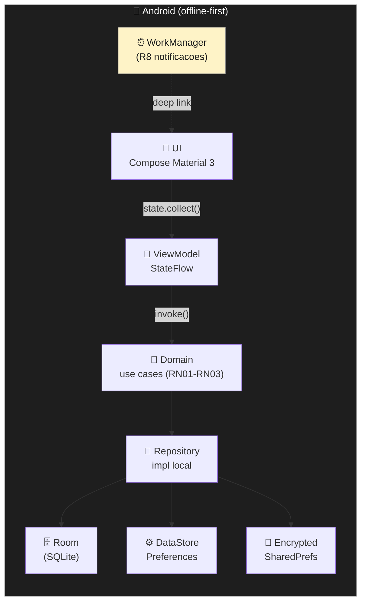

# 🏗️ Arquitetura

> **BrainOutApp** — documento vivo.
> 📅 Última atualização: 2026-09-17 (mudança de escopo: 100% offline)

## 📐 Visão geral

Aplicativo **Android nativo** (Kotlin + Jetpack Compose), 100% offline. Persistência local com Room como fonte da verdade; configuração de perfil e (opcional) senha local em DataStore Preferences / EncryptedSharedPreferences. Sem backend, sem autenticação online, sem sincronização entre dispositivos.

> 📌 **Mudança registrada:** o backend Python (FastAPI) e toda a camada de rede/Retrofit saíram do plano (issue #14 fechada como não-aplicável). Ver [`adr/0005-sem-autenticacao-online.md`](adr/0005-sem-autenticacao-online.md) e [`adr/0006-perfil-local-opcional.md`](adr/0006-perfil-local-opcional.md).

```text
┌──────────────────────────┐
│ 📱 Android (Kotlin)      │   ← tudo aqui, 100% offline
│                          │
│  ┌────────────────────┐  │
│  │ 🎨 UI (Compose)     │  │
│  │  - screens/         │  │
│  │  - components/      │  │
│  └────────┬───────────┘  │
│           │              │
│  ┌────────▼───────────┐  │
│  │ 🧠 ViewModel        │  │
│  │ (StateFlow)        │  │
│  └────────┬───────────┘  │
│           │              │
│  ┌────────▼───────────┐  │
│  │ 📐 Domain           │  │
│  │ (use cases,         │  │
│  │  RN01-RN03)         │  │
│  └────────┬───────────┘  │
│           │              │
│  ┌────────▼───────────┐  │
│  │ 💾 Data              │  │
│  │  - Room (local)     │  │
│  │  - DataStore Prefs  │  │
│  │  - EncryptedShared… │  │
│  └────────────────────┘  │
└──────────────────────────┘
```



> **Removido nesta revisão:**
> - Coluna "🐍 Backend (Python)" do diagrama original (R6 não-aplicável).
> - Setas HTTPS / JWT / Retrofit (`data/remote/` não existe).
> - Sincronização pull-push, `server_version`, fila `pending_sync`.
> - Camada `app/auth/`, `JWT`, `bcrypt` (servidor).

---

## 🧱 Camadas

### 📱 Android (R12 — separação obrigatória)

> **Regra de ouro (R12):** Composable **nunca** contém lógica de negócio. ViewModel orquestra → Use Case executa regra → Repository persiste.

| Camada | Pacote | Responsabilidade |
|--------|--------|------------------|
| 🎨 `ui/` | `com.joaopedrogms.brainoutapp.ui` | Composables, navegação, tema Material 3 |
| 🎨 `ui/screens/<feature>` | `…ui.screens.projetos` | Telas por feature |
| 🎨 `ui/screens/onboarding` | `…ui.screens.onboarding` | Tela de seleção de perfil (1ª execução) |
| 🎨 `ui/screens/applock` | `…ui.screens.applock` | Tela de bloqueio por senha (cold start, se senha definida) |
| 🧠 `viewmodel/` | `…viewmodel` | `StateFlow` da UI, eventos |
| 📐 `domain/` | `…domain.model` | Entidades puras, regras RN01-RN03 |
| 📐 `domain/usecase/` | `…domain.usecase` | Casos de uso (criar projeto, marcar tarefa, alterar perfil) |
| 💾 `data/local/` | `…data.local` | Room: DAOs, entities, migrations |
| 💾 `data/preferences/` | `…data.preferences` | DataStore: perfil, flags de onboarding, UX prefs |
| 💾 `data/security/` | `…data.security` | EncryptedSharedPreferences: hash da senha (opcional) |
| 💾 `data/repository/` | `…data.repository` | Implementação local (Room + DataStore + EncryptedSP) |
| ⏰ `work/` | `…work` | WorkManager: notificações de prazo (R8) |
| 🪡 `di/` | `…di` | Módulos Hilt |

### 🚫 Camada de rede

**Removida.** Não há `data/remote/`, não há Retrofit, não há OkHttp, não há interceptors. A justificativa está em [`adr/0005-sem-autenticacao-online.md`](adr/0005-sem-autenticacao-online.md).

### 🚫 Backend Python (FastAPI)

**Removido do plano.** A pasta `backend/` deixou de fazer parte do roadmap (issue #14 fechada como não-aplicável em 2026-09-17). Ver ADR-0005.

---

## 🗃️ Modelo de dados

```text
┌──────────────────┐ 1     n ┌──────────────────┐
│  📁 Projeto      │────────►│  ✅  Tarefa       │
├──────────────────┤         ├──────────────────┤
│ id (UUID v7)     │         │ id (UUID v7)     │
│ nome             │         │ projeto_id  FK   │
│ descricao        │         │ dependente_id FK │
│ data_inicio      │         │ titulo           │
│ prazo            │         │ descricao        │
│ status           │         │ prioridade       │
│ created_at UTC   │         │ status           │
│ updated_at UTC   │         │ prazo            │
│ deleted_at       │         │ created_at UTC   │
└──────────────────┘         │ updated_at UTC   │
                            │ deleted_at       │
                            └──────────────────┘

⚙️ DataStore Preferences
   - perfil_usuario: enum { GERENTE, COLABORADOR }
   - onboarding_concluido: boolean
   - (futuro) preferences UX

🔐 EncryptedSharedPreferences (somente se senha definida)
   - senha_hash
   - (sem salt exposto — gerado internamente por EncryptedSharedPreferences)
```

> ⚠️ **Perfil NÃO é entidade do banco** — é configuração do app (ADR-0006). Não há registro de auth no banco.

Decisões detalhadas em [`modelo-dados.md`](modelo-dados.md):

- 🔑 **UUID v7** como PK (ordenável por tempo, melhor indexação local).
- 🗑️ **Soft delete** com `deleted_at` (mantém histórico).
- 🕐 Timestamps em **UTC**, conversão no cliente.
- 🔗 `ON DELETE RESTRICT` em Tarefa→Projeto (RN02).
- 🚫 Sem `server_version`, sem `pending_sync`, sem colunas de auth.

---

## 📐 Regras de negócio (RN01-RN03)

> Implementadas em `domain/` no Android **apenas** — sem servidor para revalidar. ViewModel e Use Case aplicam as regras; a UI mostra mensagens amigáveis (R10).

| ID | Regra | Onde validar | Mensagem |
|----|-------|--------------|----------|
| **RN01** | Tarefa só pode ser concluída se todas as dependências estiverem concluídas | `domain/usecase/ConcluirTarefaUseCase` | _"Não é possível concluir: a tarefa '<título>' ainda está pendente."_ |
| **RN02** | Projeto não pode ser concluído enquanto houver tarefa aberta | `domain/usecase/ConcluirProjetoUseCase` | _"Projeto tem <N> tarefa(s) em aberto."_ |
| **RN03** | Prazo de tarefa não pode ultrapassar o prazo do projeto | `domain/usecase/CriarTarefaUseCase`, `EditarTarefaUseCase` | _"Prazo da tarefa (DD/MM) ultrapassa o prazo do projeto (DD/MM)."_ |

📄 Detalhamento + testes em [`regras-negocio.md`](regras-negocio.md).

---

## 🔔 Recursos nativos (R8)

Notificações locais agendadas via **WorkManager** (sobrevive a reboot). Permissão solicitada em contexto (Android 13+). Deep link abre a tarefa correspondente.

> WorkManager continua sendo a ferramenta correta mesmo sem backend: ele dispara `OneTimeWorkRequest` a partir de `deadline` armazenado em Room.

📄 Decisão registrada em [`docs/adr/0003-recurso-nativo-notificacoes.md`](adr/0003-recurso-nativo-notificacoes.md).

## 🌐 Integração externa (R7)

Como o app é 100% offline (ADR-0005), integração externa fica **fora do escopo** desta revisão. Caso seja reintroduzida (issue #15), vira um ADR-0007 próprio com decisão separada ("consumir direto do app" vs "via backend" — este último já é não-aplicável).

> 📄 Decisão original (BrasilAPI feriados) documentada em [`docs/adr/0004-integracao-externa.md`](adr/0004-integracao-externa.md) — status **pendente** até #15 ser reavaliada.

---

## 🧪 Padrões transversais

| Tema | Padrão |
|------|--------|
| 🪡 Injeção de dependência | Hilt |
| ⚡ Assíncrono | Coroutines + `Flow` |
| 📜 Logs | Logcat + Timber |
| ❌ Erros | `sealed class Result` (Sucesso / Erro / Carregando) |
| 🔐 Config | `local.properties` + `EncryptedSharedPreferences` |
| 🧪 Testes | JUnit + MockK + Turbine (testes de `Flow`) |
| ⚙️ Preferências | DataStore Preferences |
| 🔐 Segredos locais | `androidx.security:security-crypto` (EncryptedSharedPreferences) |

> 🚫 **Removido nesta revisão:**
> - FastAPI `Depends`, `async def` no servidor, `AsyncSession`.
> - SQLAlchemy, Alembic, Pydantic.
> - Retrofit, OkHttp, JWT, bcrypt, structlog.
> - HTTPException (substituído por `Result.Error`).
> - `.env` no servidor, GitHub Secrets para credenciais de backend.

---

## 🔐 Identidade, perfil e AppLock (resumo das decisões)

| Decisão | Onde | Doc |
|---------|------|-----|
| Sem autenticação online | Repositório inteiro | [ADR-0005](adr/0005-sem-autenticacao-online.md) |
| Perfil local (Gerente / Colaborador) | `data/preferences/` | [ADR-0006](adr/0006-perfil-local-opcional.md) |
| Senha opcional (AppLock) | `data/security/` | [ADR-0006](adr/0006-perfil-local-opcional.md) |

Verbos de rastreabilidade:

- **R2** → "Autenticação com 2 perfis" deixou de ser autenticação. Vira **seleção de perfil local** (ADR-0006). Status no README: 🟡 Não-aplicável como auth.
- **R6** → "Persistência remota + sincronização" → 🟡 **Não-aplicável** (ADR-0005). App 100% offline.

---

## 💸 Custos e self-hosting

| Item | 💰 | Observação |
|------|----|------------|
| GitHub Actions | $0 | 2000 min/mês free em repo público |
| GitHub Projects | $0 | Plano free |
| ~~PostgreSQL self-hosted~~ | ~~$0~~ | ❌ Removido do plano |
| ~~API externa (BrasilAPI / ViaCEP)~~ | ~~$0~~ | ⏸ Fora do escopo desta revisão (R7) |
| SonarCloud / Codecov | $0 | Free para OSS |
| Domínio / hospedagem | _opcional_ | Apresentação roda local no APK |

> 🎯 Toda a stack é **open source** ou **self-hosted**. Nenhum SaaS pago.

---

## 🛣️ Próximas revisões

- 🪪 Tela de onboarding (escolha de perfil) — issue **#7** (reciclada)
- 🔐 AppLock com senha opcional — issue **#7** ou issue separada
- 📊 Biblioteca de gráficos do dashboard — issue **#13**
- 🟢 ~~Resolução de conflito de sync~~ — ❌ Removida (ADR-0005)

---

<div align="center">

<sub>🧠 BrainOutApp — gestão de projetos sem perder prazos, mesmo offline. Agora, 100% offline.</sub>

</div>
