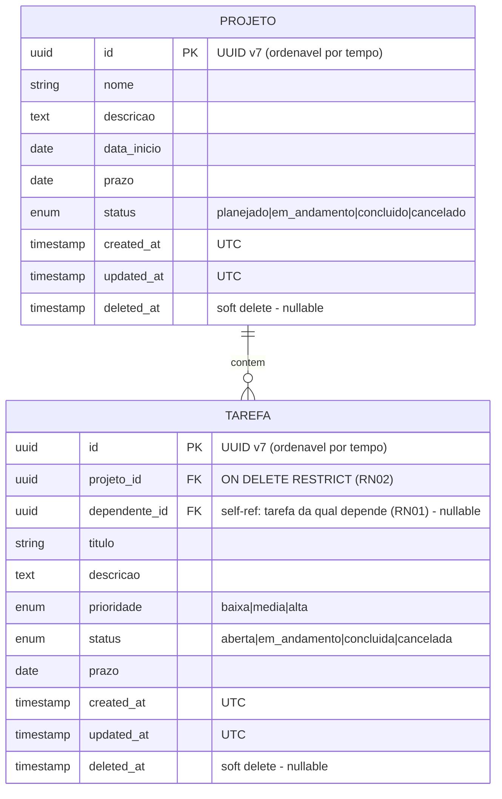

# Modelo de Dados (resumo)

Diagrama ER — versão **offline-only**. Detalhamento em [`arquitetura.md`](../arquitetura.md) e modelagem completa no documento de projeto (#1, Apêndice A.1). Decisões de autenticação e perfil local em [`adr/0005-sem-autenticacao-online.md`](adr/0005-sem-autenticacao-online.md) e [`adr/0006-perfil-local-opcional.md`](adr/0006-perfil-local-opcional.md).

> **Mudança de escopo (2026-09-17):** o app BrainOutApp é **100% local**. **Não há tabela de auth no banco**: o dono do dispositivo é o "usuário" do app e seu perfil é salvo em **DataStore Preferences** (ver ADR-0006), não como entidade relacional.

> ⚠️ **Perfil do usuário não é uma entidade do banco** — é uma `enum class Perfil { GERENTE, COLABORADOR }` salva em **DataStore Preferences** no app (chave `perfil`). Senha opcional, se definida, é hash salvo em `EncryptedSharedPreferences` (chave derivada) — ver ADR-0006. App é single-user por dispositivo.

## Decisões

- 🔑 **UUID v7** como PK (ordenável por tempo, evita fragmentação de índice local). Decisão registrada em ADR (issue #14 foi avaliada; ADR-0005 substitui a justificativa original).
- 🗑️ **Soft delete** em Projeto e Tarefa (campo `deleted_at`, nullable). Mantém histórico para relatórios e para recuperação de exclusões acidentais. Queries filtram `WHERE deleted_at IS NULL`.
- 🕐 **Timestamps em UTC**; conversão (`LocalDateTime`) no cliente Android para exibição.
- 🔤 **Enums** como `TEXT` no Room (legibilidade + migrations simples, sem `TypeConverter` extra).
- 🔗 **`ON DELETE RESTRICT`** (Room: `@ForeignKey(onDelete = RESTRICT)`) em Tarefa→Projeto (regra **RN02**: não excluir projeto com tarefas abertas).
- 🚫 **Sem registro de auth**: não há autenticação online — quem usa o app é o dono do dispositivo. O perfil (Gerente/Colaborador) é uma configuração do app, persistida em DataStore Preferences, não um registro no banco.
- 🚫 **Sem `server_version`**: como não há backend nem sincronização (ver ADR-0005), o controle de conflito deixa de existir. A coluna é removida do modelo local (não há nada para sincronizar).

## Escopo de cada issue (rastreabilidade R* ↔ modelo)

- **RN01 — dependência entre tarefas**: implementada em #11, **usa o campo `dependente_id`** (self-FK) que está no ER acima.
- **R5 (offline + persistência local)** — soft delete + timestamps cobrem auditoria local.
- **R2 (autenticação com 2 perfis)** — **não-aplicável como autenticação**. Vira "seleção de perfil local" (ADR-0006); sem entidade de auth no banco.
- **R6 (sincronização)** — **não-aplicável**. App 100% offline (ADR-0005); sem `server_version`, sem `/sync`.

## Storage no app Android

| Camada | Tecnologia | Guarda |
|--------|-----------|--------|
| `data/local/` | Room (SQLite local) | `projeto`, `tarefa` (entities acima) |
| `data/preferences/` | DataStore Preferences | `perfil` (enum serializado), flags de onboarding, preferências UX |
| `data/security/` | EncryptedSharedPreferences (`androidx.security:security-crypto`) | hash da senha de AppLock (somente se usuário definiu senha) |

> As três camadas acima são **locais**. Nada sai do dispositivo — não há API, não há JWT, não há Retrofit.

## Migrations

Versionadas com **Room schema export** (Android). Schema versionado no repo em `android/app/schemas/`. Não há mais migrations Alembic porque o backend Python não faz parte do plano (issue #14 fechada como não-aplicável).

## "Sincronização" — onde ficou

Não existe. O termo "sync" foi removido do roadmap (ADR-0005). O que existia:

| Item | Status anterior | Status atual (2026-09-17) |
|------|------------------|---------------------------|
| `/sync` endpoint (FastAPI) | R6, ciclo 3 | ❌ Removido — backend Python fora do plano |
| `server_version` (bigint) | controle de conflito | ❌ Removido — sem servidor |
| Coluna `pending_sync` (Room) | fila para WorkManager postar | ❌ Removido — não há para quem postar |
| Resolução de conflito server-wins | ADR previsto | ❌ Removido — sem servidor |
