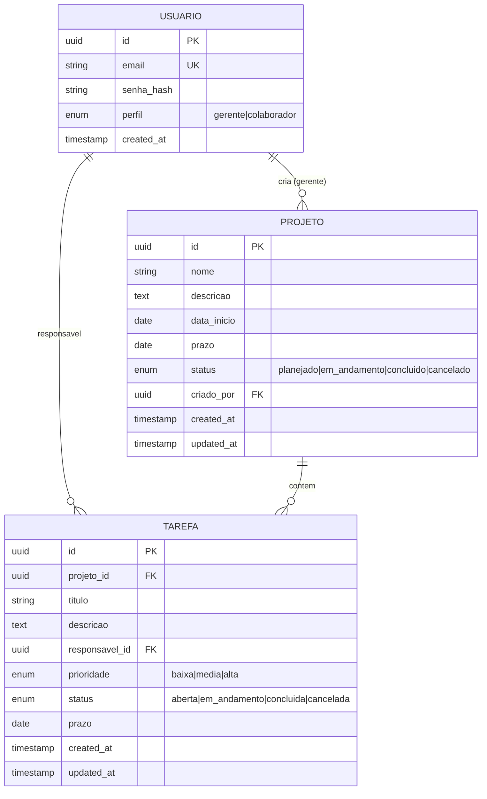

# Modelo de Dados (resumo)

Diagrama ER — versão inicial. Detalhamento em [`arquitetura.md`](../arquitetura.md) e modelagem completa no documento de projeto (#1, Apêndice A.1).

## Decisões

- **UUID v7** como PK (ordenável por tempo, melhor para sync) — registrar em ADR quando #14 for implementada
- **Soft delete** em Projeto e Tarefa (campo `deleted_at`) — manter histórico para sync e relatórios
- **Timestamps** em UTC; conversão no cliente
- **Enums** como string no banco (legibilidade, migrations simples)
- **FK com `ON DELETE RESTRICT`** em Tarefa→Projeto (regra RN02: não excluir projeto com tarefas abertas)

## Migrations

Versionadas com **Alembic** (backend) e **Room schema export** (Android, R5). Schema versionado no repo em `backend/alembic/versions/` e `android/app/schemas/`.

## Sincronização (R6)

Cada entidade carrega `updated_at` e `server_version`. Cliente usa `updated_at` para resolver conflito (server-wins, ver [`arquitetura.md`](../arquitetura.md#sincronização-offline--online-r6)).
